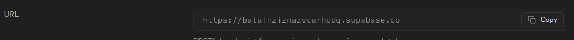
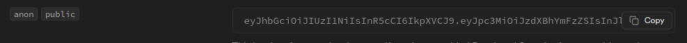
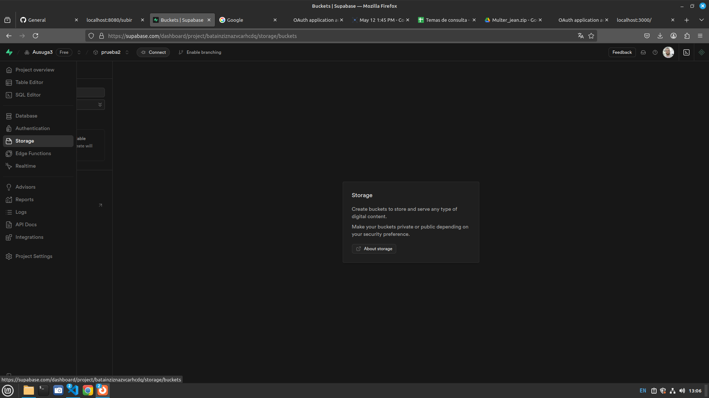
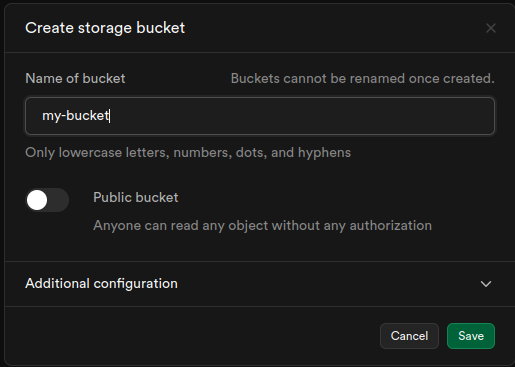
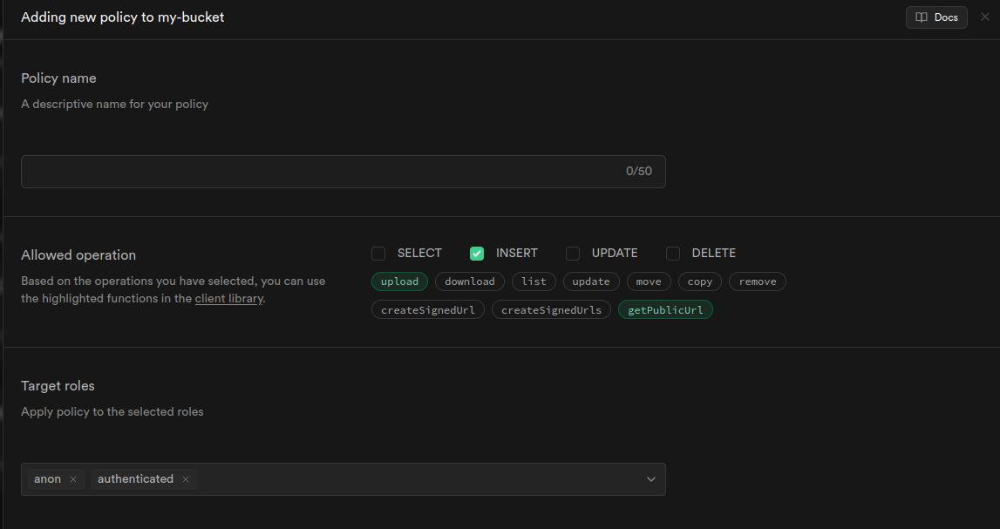
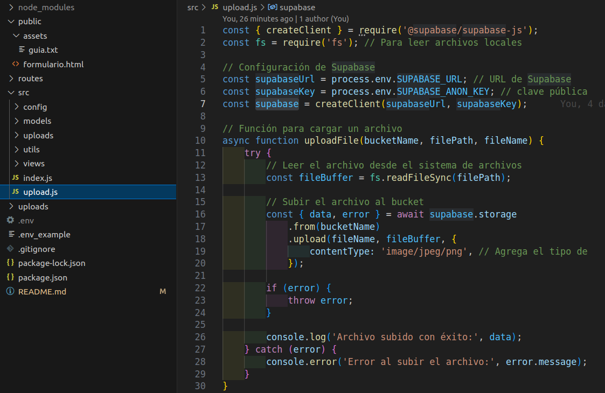
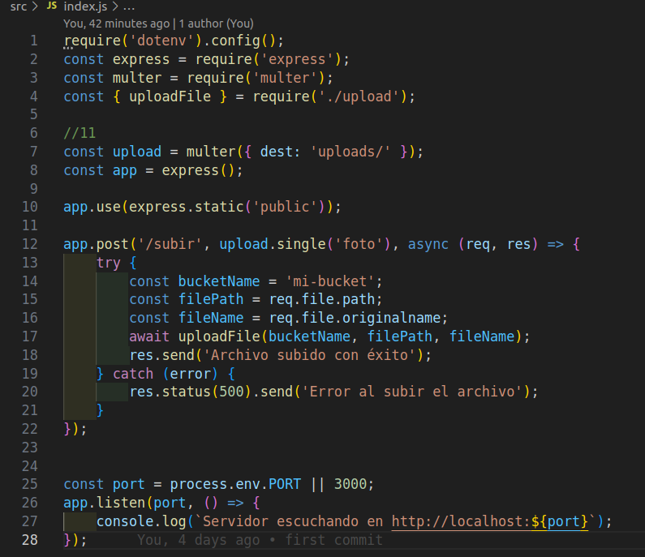
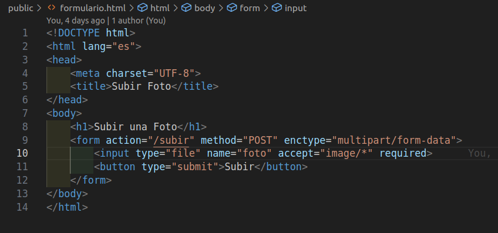

# Mi Proyecto Node

Este es un proyecto de ejemplo creado con Node.js, Express, MongoDB y Supabase Storage. Permite subir imágenes desde un formulario web y almacenarlas en un bucket de Supabase. Además, incluye un modelo de usuario con Mongoose y configuración de base de datos.

## Estructura del Proyecto

```
mi-proyecto-node
├── .env                       # Variables de entorno (no subir a git)
├── package.json               # Configuración de npm y dependencias
├── public/                    # Archivos estáticos (formulario y recursos)
│   ├── formulario.html        # Formulario para subir imágenes
│   └── assets/
│       └── guia.txt           # Guía rápida de configuración Supabase
├── routes/                    # (Reservado para rutas adicionales)
├── src/
│   ├── index.js               # Punto de entrada de la aplicación Express
│   ├── upload.js              # Lógica para subir archivos a Supabase
│   ├── config/
│   │   └── connection.js      # Conexión a MongoDB con Mongoose
│   ├── models/
│   │   └── usuario.js         # Modelo de usuario con Mongoose
│   ├── utils/
│   │   └── helpers.js         # Funciones de utilidad
│   └── views/
│       └── pages/
│           └── landin.ejs     # Vista de ejemplo con EJS
├── uploads/                   # Archivos subidos temporalmente por Multer
└── README.md                  # Documentación del proyecto
```

## Instalación

1. Clona el repositorio y entra en la carpeta del proyecto.
2. Copia el archivo `.env` y configura tus variables de entorno (ver ejemplo en el repo).
3. Instala las dependencias:

```
npm install
```

## Uso

Para iniciar la aplicación en modo desarrollo:

```
npm run dev
```

O en modo producción:

```
npm start
```

Luego abre [http://localhost:8080/formulario.html](http://localhost:8080/formulario.html) para acceder al formulario de subida de imágenes.

## Funcionalidades

- **Subida de imágenes**: El formulario en `public/formulario.html` permite subir imágenes, que se almacenan en Supabase Storage usando [`src/upload.js`](src/upload.js).
- **Modelo de usuario**: Definido en [`src/models/usuario.js`](src/models/usuario.js) y conectado a MongoDB Atlas mediante [`src/config/connection.js`](src/config/connection.js).
- **Variables de entorno**: Configura tus claves y credenciales en el archivo `.env`.
- **Vistas**: Ejemplo de vista EJS en [`src/views/pages/landin.ejs`](src/views/pages/landin.ejs).

## Dependencias principales

- [express](https://www.npmjs.com/package/express)
- [multer](https://www.npmjs.com/package/multer)
- [mongoose](https://www.npmjs.com/package/mongoose)
- [@supabase/supabase-js](https://www.npmjs.com/package/@supabase/supabase-js)
- [dotenv](https://www.npmjs.com/package/dotenv)
- [ejs](https://www.npmjs.com/package/ejs)
- [nodemon](https://www.npmjs.com/package/nodemon) (desarrollo)

## Notas

- No olvides crear tu bucket en Supabase y configurar las políticas de acceso como se indica en [`public/assets/guia.txt`](public/assets/guia.txt).
- Los archivos subidos se almacenan temporalmente en la carpeta `uploads/` antes de enviarse a Supabase.

## Contribuciones

Las contribuciones son bienvenidas. Si deseas contribuir, por favor abre un issue o envía un pull request.


## GUIA DE USO

- 1: Registrarse en Supabase.
- 2: Crear un nuevo proyecto.

- 3: En "View API Settings" extraer tu URL y tu anon Public Key.
    
    
    

- 4: En el menú izquierdo ir a "Storage" y crear un nuevo bucket (por ejemplo, mi-bucket).
    
    

- 5: Crear nuevas políticas:
    - En "Storage > Policies" crea una política (por ejemplo, "upload allow").
    - Agrega permiso INSERT y en "target roles" pon anon y authenticated.
        

- 6: En el proyecto, instalar el cliente de Supabase:
    npm i @supabase/supabase-js

- 7: En la carpeta src, crear el archivo upload.js con la lógica para subir archivos a Supabase.
- 8: Usar la URL y la Key de Supabase en el archivo upload.js y configurar el tipo de archivo que se va a subir.
    

- 9: Crear la carpeta uploads para guardar los archivos temporalmente.
- 10: Instalar Multer para manejar la subida de archivos:
    npm i multer

- 11: Configurar Express y Multer en src/index.js para recibir archivos desde un formulario.
    

- 12: Crear un formulario HTML en public/formulario.html para probar la subida.
    

- 13: Instalar dotenv para manejar variables de entorno:
    npm i dotenv

- 14: Crear un archivo .env en la raíz del proyecto y agregar tus variables:
    PORT=8080
    SUPABASE_URL=tu_url_de_supabase
    SUPABASE_ANON_KEY=tu_anon_key

- 15: Iniciar el servidor con:
    npm run dev
- 16:  Abrir el navegador en http://localhost:8080/formulario.html y probar la subida de archivos.
- 18: Verificar en el panel de Supabase que el archivo se haya subido correctamente al bucket.


Extra!!
- npm install mime-types (para subir cualquier tipo de archivos)

